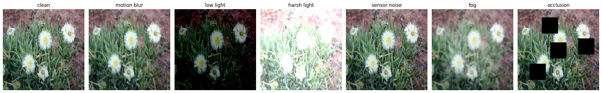
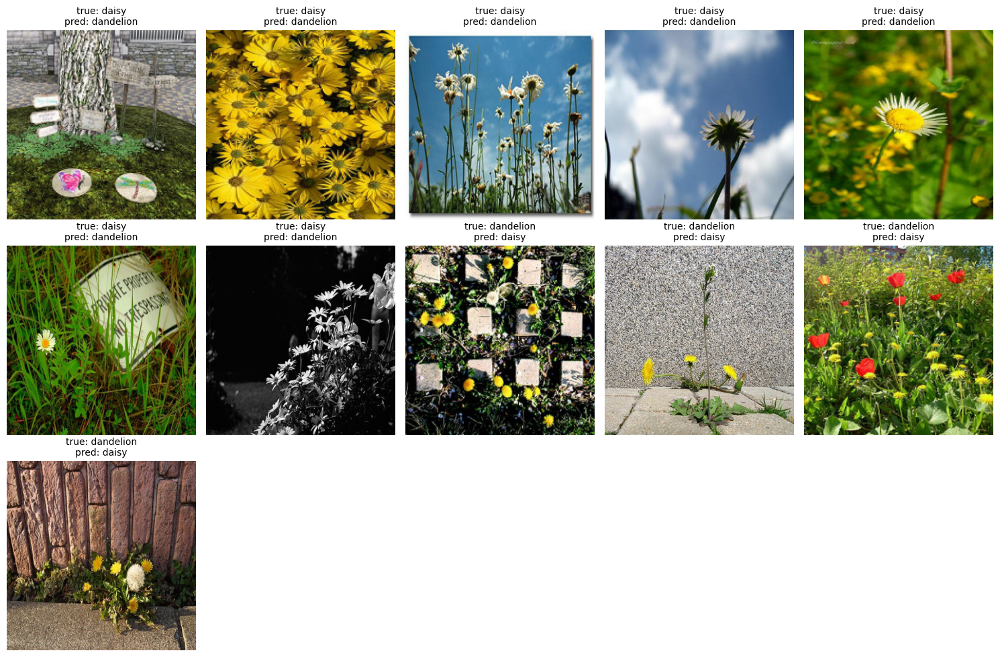

# Daisy vs Dandelion: how a flower classifier holds up in the field

A fine-tuned **ResNet18** reaches **0.938 macro F1** on the test set (11 errors out of 182).
It is unaffected by motion blur, low light and sensor noise, but harsh light, fog and occlusion cost 3–4 points —
because the model relies on the colour contrast between white petals and yellow heads.

| Model | Frozen backbone | + fine-tuning | + fine-tuning + augmentation |
|:---|---:|---:|---:|
| MobileNetV3-Small (1.5M) | 0.8866 | — | — |
| EfficientNet-B0 (4.0M) | 0.9089 | — | — |
| **ResNet18 (11.2M)** | 0.9333 | 0.9498 | **0.9611** |
| ResNet50 (23.5M) | 0.9498 | 0.9557 | 0.9528 |

*Validation macro F1. The final model is selected on validation only; the test set is used once.*

## Robustness to field conditions

| Condition | Test macro F1 | Δ vs clean |
|:---|---:|---:|
| clean | 0.9378 | — |
| motion blur | 0.9550 | +1.7 |
| low light | 0.9384 | +0.1 |
| sensor noise | 0.9382 | +0.0 |
| harsh light | 0.9096 | −2.8 |
| fog | 0.9038 | −3.4 |
| occlusion | 0.8939 | −4.4 |

## Where the model fails

- **Colour missing or misleading:** a black-and-white photo, yellow species labelled as daisy
- **Small flowers in clutter:** pavers, gravel, signs, other species
- **Unusual viewpoint:** daisies shot from below against the sky
- **Dandelion seed heads:** a white puffball reads as a daisy

## Key findings
- **Fine-tuning `layer4`** helps both ResNets, but they start memorising the training set (99.5–100% train accuracy)
- **Augmentation** regularises ResNet18 (+1.1 val points) and gives nothing on ResNet50
- **ResNet18 over ResNet50:** better validation F1 with half the parameters, which matters for drones and edge devices
- **Colour is the signal:** hue and saturation augmentations were deliberately excluded; errors and robustness tests confirm the dependence

## Setup
- **Data:** 1,821 images (512×512), official split 1,275 / 364 / 182, downloaded from the original source
- **Models:** pretrained backbones from `timm`, PyTorch, albumentations
- **Protocol:** same training function for every backbone; frozen screening → `layer4` fine-tuning → augmentation, each branch from the same checkpoint

## What changed after review
This started as a course project and was revised after the instructor's feedback:
- **Clean ablation:** fine-tuning used to modify the model in place, so the augmentation run silently continued from the fine-tuned weights. Each branch now starts from a copy of the same checkpoint, with the same epoch budget. The augmentation gain dropped from +1.7 to +1.1 points.
- **Reproducible data pipeline:** the dataset is downloaded from the official link. The previously undocumented cleaning step turned out to be macOS metadata (`._*` files with a `.jpg` extension) that doubled the image counts; it is now a cell in the notebook.
- **Explicit dependencies:** training functions receive loaders, loss, device and output folder as arguments instead of reading globals.
- **New analyses:** misclassified test images and a robustness test under simulated field conditions.

## Limits
- Single training run per configuration; one test image ≈ 0.55 F1 points
- Perturbations are synthetic: real drone footage is the definitive test
- Two classes only: says nothing about multi-species monitoring

## Run it
Open `flower_classifier.ipynb` in Google Colab with a GPU runtime and run all cells (~30 min on a T4).

---
*Built as the computer vision project of the ProfessionAI AI Engineering master, then extended after review.*
